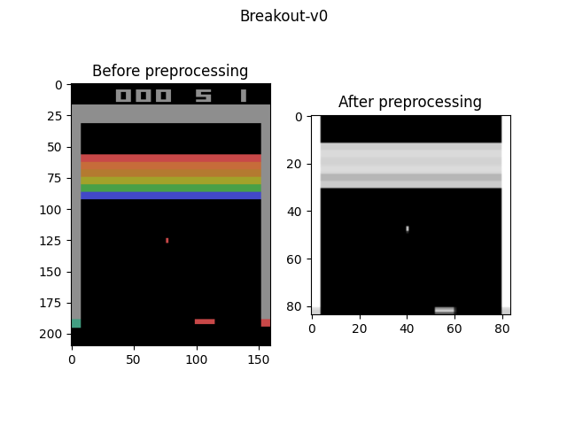

# RLKIT
## Linked repositories for IFT 3150
- Doodad Library (fork version): https://github.com/XinyuR1/doodad
- RLKIT Library (fork version): https://github.com/XinyuR1/rlkit
- SMiRL-Code: https://github.com/Neo-X/SMiRL_Code
- Docker Images: https://hub.docker.com/repository/docker/xinyur1/rlkit

## References
https://github.com/rail-berkeley/rlkit 
https://github.com/montrealrobotics/doodad
https://github.com/Neo-X/doodad 
https://github.com/Neo-X/SMiRL_Code
https://colab.research.google.com/github/GiannisMitr/DQN-Atari-Breakout/blob/master/dqn_atari_breakout.ipynb#scrollTo=_IA-czvUwbOn 


## List of Changes for this Project
This project uses this library's RL algorithm in order to run different experiments. Here are the list of changes that I've made compared to the original ``rlkit`` library:

### [atari_kit](atari_kit)
#### [preprocessing.py](atari_kit/preprocessing.py)
- Taken from https://colab.research.google.com/github/GiannisMitr/DQN-Atari-Breakout/blob/master/dqn_atari_breakout.ipynb#scrollTo=_IA-czvUwbOn
- Inputs an Atari image and preprocess it into a gray-scale image with 64 x 64 size.

#### [visualize.py](atari_kit/visualize.py)
- Python file created for seeing the difference the original Atari image and the preprocessed one (using `preprocessing.py`).
- Example using `Breakout-v0` as a given Atari environment.
<p style="text-align:center;"></p>

#### [wrappers.py](atari_kit/wrappers.py)
- Modified from Neo-X's `Smirl_Code` wrappers function.
- We changed the `reset` function from the `SoftResetWrapper`, so that the agent can play multiple Atari games in a single wrapper. We only added functions that creates a set of Atari environments while also preprocessing them.


### [rlkit](rlkit)
#### [core](rlkit/core)
##### [logging.py](rlkit/core/logging.py)
- Add new attribute in the logger called ``self._comet_log`` (with setters and getters for Atari experiments)
- Change the ``record_tabular`` function the Logger class by adding comet logs and options for epochs as x axis in the comet logs.
```python
epochs = 0
def record_tabular(self, key, val):
   global epochs
   self._tabular.append((self._tabular_prefix_str + str(key), str(val)))
        if (self._comet_log is not None):
            if key == 'epoch':
                epochs = val
                print(f'EPOCH: {epochs}')
            self._comet_log.log_metrics({str(self._tabular_prefix_str) + str(key): val}, epoch=epochs)
```

#### [data_management](rlkit/data_management)
##### [simple_replay_buffer.py](rlkit/data_management/simple_replay_buffer.py)
- For the simple replay buffer class: we change the `self._observations` and `self._next_obs` to np.float16 type arrays.
- Modified the `add_sample` function: Since images are 2-Dimensional arrays, we flatten it into a vector first before add in the buffer as a sample.

```python
def add_sample(self, observation, action, reward, next_observation,
                   terminal, env_info, **kwargs):
        flatten_obs = observation.reshape(-1)
        flatten_next_obs = next_observation.reshape(-1)
        # etc.
```

- Modified the `random_batch` function: switch self._size to `number` = 1000 due to offline RL.

```python
def random_batch(self, batch_size):
        # replace number instead of self._size
        number = 1000
        indices = np.random.choice(number, size=batch_size, replace=self._replace or self._size < batch_size)
        etc.
```

#### [exploration_strategies](rlkit/exploration_strategies)
##### [epsilon_greedy.py](rlkit/exploration_strategies/epsilon_greedy.py)
- Create two global variables so the value of epsilon can vary from 1 to 0.1 in 1 million steps. Initially, this class can only allow a fixed value of epsilon.

```python
number = 0
epsilon = 1

class EpsilonGreedy(RawExplorationStrategy):
    """
    Take a random discrete action with some probability.
    """
    def __init__(self, action_space, prob_random_action = 0.1):
        self.prob_random_action = prob_random_action
        self.action_space = action_space
    
    def get_action_from_raw_action(self, action, **kwargs):
        global number
        global epsilon
        number += 1
        threshold = 1000000

        # The value of epsilon will decrease from 1 to 0.1 in
        # 1 million steps (threshold)
        if number <= threshold:
            epsilon -= (1-0.1)/threshold
        
        if number % 1000 == 0:
            print(f'NUMBER: {number}')
            print(f'EPSILON VALUE: {epsilon}')
```

#### [launchers](rlkit/launchers)
##### [finetune_rl.py](rlkit/launchers/experiments/awac/finetune_rl.py)
- Modified the `experiment` function for IQL experiments. Instead of using actions that are continuous with SAC Algorithm, we used the DQN Algorithm to let the agent obtain discrete actions. The structure of the code remains the same as the ones in `dqn-Atari.py`, but the only difference is that we're using an IQL Trainer from the dqn repository.

##### [config_private.py](rlkit/launchers/config_private.py)
- Initially, this file was named `config.py`. The configurations for this project will be found on doodad repository, not in this file.

#### [torch](rlkit/torch)
##### [iql_trainer.py (from dqn)](rlkit/torch/dqn/iql_trainer.py)
- We copied the `iql_trainer.py` from SAC folder and pasted to dqn folder. We then modified in order to use the DQN Algorithm since Atari games can be only manipulated with discrete actions.

##### [custom.py](rlkit/torch/networks/custom.py)
- Two CNN neural networks proposed from various research papers.
- In this project, we used the 2nd CNN Model, a model architecture taken from https://arxiv.org/pdf/1312.5602.pdf.

### [Dockerfile](Dockerfile)
- Taken from Neo-X's fork version of Rlkit.
- We changed the name of the virtual environment by ``env-rlkit``.

### [doodad_example.py](doodad_example.py)
- Taken from Neo-X's version of ``doodad``.
- Dummy example in order to test the implementation of doodad before testing on Atari experiments.

### [dqn-Atari.py](dqn-Atari.py)
- Modified from the original version of ``Rlkit`` (was initially ``dqn_and_double_dqn.py``). 
- File created for the experiments of this project.
We essentially modified the networks Mlp to CNN and run the experiments for different Atari games instead of Cartpole.
- Furthermore, we run the experiments using the ``doodad`` library instead of calling the ones from ``rlkit``.

### [dqn-Cartpole.py](dqn-Cartpole.py)
- Modified from the original version of ``Rlkit`` (was initially ``dqn_and_double_dqn.py``). 
- File created for testing the DQN algorithm with a cartpole problem.
We changed the code by running the experiment with the doodad library instead of calling the ones from ``rlkit``.

### [iql-Atari.py](iql-Atari.py)
- Modified from the original version of ``Rlkit``(``rlkit/examples/iql/antmaze_finetune.py``).
- File created for testing the IQL algorithm for this project.
- Initially, it was meant for environments with continuous actions (antmaze) by using the SAC algorithm. We changed the IQL algorithm by taking discrete actions (with the DQN Algorithm). Furthermore, the experiment will be run with doodad instead of rlkit's run_experiment function.

### [requirements.txt](requirements.txt)
- Taken from Neo-X's fork version of ``RLkit``.
- Add/modify the following packages: `comet_ml`, `gym==0.18.0`, `gym[atari]`,`atari_py==0.2.6`, `opencv-python`, `pandas`, `matplotlib`
- There will be two choices: one for CPU and one for GPU
  - The difference will be in the docker images. They will use the same dockerfile, but the libraries in the requirements file will be different (cpu or gpu).
  - More changes in ``doodad`` library.

```
In the requirements.txt file: 

#FOR CPU (here_no_doodad, local and local_docker)
torch
torchvision

#FOR GPU
torch==1.10.0+cu113
torchvision==0.11.1+cu113
git+https://github.com/xinyur1/doodad.git

--find-links https://download.pytorch.org/whl/cu113/torch_stable.html
```


###################################################################

-

### July 20th, 2022: Prepare docker image.
- Modify [conf.py](rlkit/launchers/config.py) with the local directory. It has been changed to config.py.
- Add Dockerfile taken from SMiRL-code library.

### July 19th, 2022: Add Atari Experiments in rlkit library.

- Modify [custom.py](rlkit/torch/networks/stochastic/custom.py)
  - Add two CNN models for the Atari Experiments


## My Build for the Virtual Environment
```
conda create --name env-rlkit python=3.7 pip
conda activate env-rlkit
pip install -r requirements.txt
pip install -e ./
cd ../doodad
git clone git@github.com:XinyuR1/doodad.git
pip install -e ./
cd ../rlkit
```

## Commands
1. Understand the variables

- `<env-name>`
  - Cartpole: "Cartpole-v0"
  - Atari: "Breakout-v0", "Pong-v0", "BeamRider-v0", "Seaquest-v0"

- `<mode>`
  - ``here_no_doodad``: Run the experiment without doodad library.
  - ``local``: Run the experiment locally using doodad.
  - ``local_docker``: Run the experiment locally using doodad and docker.

2. Visualize the image of the environment before and after preprocessing.
```
python atari_kit/visualize.py <env-name>
```

3. Create an DQN-based algorithm experiment.
```
# If Cartpole
python dqn-Cartpole.py
# If Atari
python dqn-Atari.py
```

*****************************
# RLkit
Reinforcement learning framework and algorithms implemented in PyTorch.

Implemented algorithms:
 - Semi-supervised Meta Actor Critic
    - [example script](examples/smac/ant.py)
    - [paper](https://arxiv.org/abs/2107.03974)
    - [Documentation](docs/SMAC.md)
 - Skew-Fit
    - [example script](examples/skewfit/sawyer_door.py)
    - [paper](https://arxiv.org/abs/1903.03698)
    - [Documentation](docs/SkewFit.md)
    - Requires [multiworld](https://github.com/vitchyr/multiworld) to be installed
 - Reinforcement Learning with Imagined Goals (RIG)
    - See [this version](https://github.com/vitchyr/rlkit/tree/v0.1.2) of this repository.
    - [paper](https://arxiv.org/abs/1807.04742)
 - Temporal Difference Models (TDMs)
    - Only implemented in [v0.1.2 of RLkit](https://github.com/vitchyr/rlkit/tree/v0.1.2). See Legacy Documentation section below.
    - [paper](https://arxiv.org/abs/1802.09081)
    - [Documentation](docs/TDMs.md)
 - Hindsight Experience Replay (HER)
    - [example script](examples/her/her_sac_gym_fetch_reach.py)
    - [paper](https://arxiv.org/abs/1707.01495)
    - [Documentation](docs/HER.md)
 - (Double) Deep Q-Network (DQN)
    - [example script](examples/dqn_and_double_dqn.py)
    - [paper](https://arxiv.org/abs/1509.06461.pdf)
    - [Double Q-learning paper](https://www.nature.com/articles/nature14236)
 - Soft Actor Critic (SAC)
    - [example script](examples/sac.py)
    - [original paper](https://arxiv.org/abs/1801.01290) and [updated
    version](https://arxiv.org/abs/1812.05905)
    - [TensorFlow implementation from author](https://github.com/rail-berkeley/softlearning)
    - Includes the "min of Q" method, the entropy-constrained implementation,
     reparameterization trick, and numerical tanh-Normal Jacbian calcuation.
 - Twin Delayed Deep Determinstic Policy Gradient (TD3)
    - [example script](examples/td3.py)
    - [paper](https://arxiv.org/abs/1802.09477)
 - Advantage Weighted Actor Critic (AWAC)
    - [example scripts](examples/awac)
    - [paper](https://arxiv.org/abs/2006.09359)
 - Implicit Q-Learning (IQL)
    - [example scripts](examples/iql)
    - [paper](https://arxiv.org/abs/2110.06169)

To get started, checkout the example scripts, linked above.

## What's New
### Version 0.2

#### 04/25/2019
 - Use new `multiworld` code that requires explicit environment registration.
 - Make installation easier by adding `setup.py` and using default `conf.py`.

#### 04/16/2019
 - Log how many train steps were called
 - Log `env_info` and `agent_info`.

#### 04/05/2019-04/15/2019
 - Add rendering
 - Fix SAC bug to account for future entropy (#41, #43)
 - Add online algorithm mode (#42)

#### 04/05/2019

The initial release for 0.2 has the following major changes:
 - Remove `Serializable` class and use default pickle scheme.
 - Remove `PyTorchModule` class and use native `torch.nn.Module` directly.
 - Switch to batch-style training rather than online training.
   - Makes code more amenable to parallelization.
   - Implementing the online-version is straightforward.
 - Refactor training code to be its own object, rather than being integrated
 inside of `RLAlgorithm`.
 - Refactor sampling code to be its own object, rather than being integrated
 inside of `RLAlgorithm`.
 - Implement [Skew-Fit:
State-Covering Self-Supervised Reinforcement Learning](https://arxiv.org/abs/1903.03698),
a method for performing goal-directed exploration to maximize the entropy of
visited states.
 - Update soft actor-critic to more closely match TensorFlow implementation:
   - Rename `TwinSAC` to just `SAC`.
   - Only have Q networks.
   - Remove unnecessary policy regualization terms.
   - Use numerically stable Jacobian computation.

Overall, the refactors are intended to make the code more modular and
readable than the previous versions.

### Version 0.1
#### 12/04/2018
 - Add RIG implementation

#### 12/03/2018
 - Add HER implementation
 - Add doodad support

#### 10/16/2018
 - Upgraded to PyTorch v0.4
 - Added Twin Soft Actor Critic Implementation
 - Various small refactor (e.g. logger, evaluate code)

## Installation

1. Install and use the included Ananconda environment
```
$ conda env create -f environment/[linux-cpu|linux-gpu|mac]-env.yml
$ source activate rlkit
(rlkit) $ python examples/ddpg.py
```
Choose the appropriate `.yml` file for your system.
These Anaconda environments use MuJoCo 1.5 and gym 0.10.5.
You'll need to [get your own MuJoCo key](https://www.roboti.us/license.html) if you want to use MuJoCo.

2. Add this repo directory to your `PYTHONPATH` environment variable or simply
run:
```
pip install -e .
```

3. (Optional) Copy `conf.py` to `conf_private.py` and edit to override defaults:
```
cp rlkit/launchers/conf.py rlkit/launchers/conf_private.py
```

4. (Optional) If you plan on running the Skew-Fit experiments or the HER
example with the Sawyer environment, then you need to install
[multiworld](https://github.com/vitchyr/multiworld).

DISCLAIMER: the mac environment has only been tested without a GPU.

For an even more portable solution, try using the docker image provided in `environment/docker`.
The Anaconda env should be enough, but this docker image addresses some of the rendering issues that may arise when using MuJoCo 1.5 and GPUs.
The docker image supports GPU, but it should work without a GPU.
To use a GPU with the image, you need to have [nvidia-docker installed](https://github.com/nvidia/nvidia-docker/wiki/Installation-(version-2.0)).

## Using a GPU
You can use a GPU by calling
```
import rlkit.torch.pytorch_util as ptu
ptu.set_gpu_mode(True)
```
before launching the scripts.

If you are using `doodad` (see below), simply use the `use_gpu` flag:
```
run_experiment(..., use_gpu=True)
```

## Visualizing a policy and seeing results
During training, the results will be saved to a file called under
```
LOCAL_LOG_DIR/<exp_prefix>/<foldername>
```
 - `LOCAL_LOG_DIR` is the directory set by `rlkit.launchers.config.LOCAL_LOG_DIR`. Default name is 'output'.
 - `<exp_prefix>` is given either to `setup_logger`.
 - `<foldername>` is auto-generated and based off of `exp_prefix`.
 - inside this folder, you should see a file called `params.pkl`. To visualize a policy, run

```
(rlkit) $ python scripts/run_policy.py LOCAL_LOG_DIR/<exp_prefix>/<foldername>/params.pkl
```
or
```
(rlkit) $ python scripts/run_goal_conditioned_policy.py LOCAL_LOG_DIR/<exp_prefix>/<foldername>/params.pkl
```
depending on whether or not the policy is goal-conditioned.

If you have rllab installed, you can also visualize the results
using `rllab`'s viskit, described at
the bottom of [this page](http://rllab.readthedocs.io/en/latest/user/cluster.html)

tl;dr run

```bash
python rllab/viskit/frontend.py LOCAL_LOG_DIR/<exp_prefix>/
```
to visualize all experiments with a prefix of `exp_prefix`. To only visualize a single run, you can do
```bash
python rllab/viskit/frontend.py LOCAL_LOG_DIR/<exp_prefix>/<folder name>
```

Alternatively, if you don't want to clone all of `rllab`, a repository containing only viskit can be found [here](https://github.com/vitchyr/viskit). You can similarly visualize results with.
```bash
python viskit/viskit/frontend.py LOCAL_LOG_DIR/<exp_prefix>/
```
This `viskit` repo also has a few extra nice features, like plotting multiple Y-axis values at once, figure-splitting on multiple keys, and being able to filter hyperparametrs out.

## Visualizing a goal-conditioned policy
To visualize a goal-conditioned policy, run
```
(rlkit) $ python scripts/run_goal_conditioned_policy.py
LOCAL_LOG_DIR/<exp_prefix>/<foldername>/params.pkl
```

## Launching jobs with `doodad`
The `run_experiment` function makes it easy to run Python code on Amazon Web
Services (AWS) or Google Cloud Platform (GCP) by using
[this fork of doodad](https://github.com/vitchyr/doodad/tree/v0.2.1).

It's as easy as:
```
from rlkit.launchers.launcher_util import run_experiment

def function_to_run(variant):
    learning_rate = variant['learning_rate']
    ...

run_experiment(
    function_to_run,
    exp_prefix="my-experiment-name",
    mode='ec2',  # or 'gcp'
    variant={'learning_rate': 1e-3},
)
```
You will need to set up parameters in config.py (see step one of Installation).
This requires some knowledge of AWS and/or GCP, which is beyond the scope of
this README.
To learn more, more about `doodad`, [go to the repository](https://github.com/vitchyr/doodad/), which is based on [this original repository](https://github.com/justinjfu/doodad/).

# Requests for pull-requests
 - Implement policy-gradient algorithms.
 - Implement model-based algorithms.

# Legacy Code (v0.1.2)
For Temporal Difference Models (TDMs) and the original implementation of
Reinforcement Learning with Imagined Goals (RIG), run
`git checkout tags/v0.1.2`.

# References
The algorithms are based on the following papers

[Offline Meta-Reinforcement Learning with Online Self-Supervision](https://arxiv.org/abs/2107.03974)
Vitchyr H. Pong, Ashvin Nair, Laura Smith, Catherine Huang, Sergey Levine. arXiv preprint, 2021.

[Skew-Fit: State-Covering Self-Supervised Reinforcement Learning](https://arxiv.org/abs/1903.03698).
Vitchyr H. Pong*, Murtaza Dalal*, Steven Lin*, Ashvin Nair, Shikhar Bahl, Sergey Levine. ICML, 2020.

[Visual Reinforcement Learning with Imagined Goals](https://arxiv.org/abs/1807.04742).
Ashvin Nair*, Vitchyr Pong*, Murtaza Dalal, Shikhar Bahl, Steven Lin, Sergey Levine. NeurIPS 2018.

[Temporal Difference Models: Model-Free Deep RL for Model-Based Control](https://arxiv.org/abs/1802.09081).
Vitchyr Pong*, Shixiang Gu*, Murtaza Dalal, Sergey Levine. ICLR 2018.

[Hindsight Experience Replay](https://arxiv.org/abs/1707.01495).
Marcin Andrychowicz, Filip Wolski, Alex Ray, Jonas Schneider, Rachel Fong, Peter Welinder, Bob McGrew, Josh Tobin, Pieter Abbeel, Wojciech Zaremba. NeurIPS 2017.

[Deep Reinforcement Learning with Double Q-learning](https://arxiv.org/abs/1509.06461).
Hado van Hasselt, Arthur Guez, David Silver. AAAI 2016.

[Human-level control through deep reinforcement learning](https://www.nature.com/articles/nature14236).
Volodymyr Mnih, Koray Kavukcuoglu, David Silver, Andrei A. Rusu, Joel Veness, Marc G. Bellemare, Alex Graves, Martin Riedmiller, Andreas K. Fidjeland, Georg Ostrovski, Stig Petersen, Charles Beattie, Amir Sadik, Ioannis Antonoglou, Helen King, Dharshan Kumaran, Daan Wierstra, Shane Legg, Demis Hassabis. Nature 2015.

[Soft Actor-Critic Algorithms and Applications](https://arxiv.org/abs/1812.05905).
Tuomas Haarnoja, Aurick Zhou, Kristian Hartikainen, George Tucker, Sehoon Ha, Jie Tan, Vikash Kumar, Henry Zhu, Abhishek Gupta, Pieter Abbeel, Sergey Levine. arXiv preprint, 2018.

[Soft Actor-Critic: Off-Policy Maximum Entropy Deep Reinforcement Learning with a Stochastic Actor](https://arxiv.org/abs/1801.01290).
Tuomas Haarnoja, Aurick Zhou, Pieter Abbeel, and Sergey Levine. ICML, 2018.

[Addressing Function Approximation Error in Actor-Critic Methods](https://arxiv.org/abs/1802.09477)
Scott Fujimoto, Herke van Hoof, David Meger. ICML, 2018.

# Credits
This repository was initially developed primarily by [Vitchyr Pong](https://github.com/vitchyr), until July 2021, at which point it was transferred to the RAIL Berkeley organization and is primarily maintained by [Ashvin Nair](https://github.com/anair13).
Other major collaborators and contributions:
 - [Murtaza Dalal](https://github.com/mdalal2020)
 - [Steven Lin](https://github.com/stevenlin1111)

A lot of the coding infrastructure is based on [rllab](https://github.com/rll/rllab).
The serialization and logger code are basically a carbon copy of the rllab versions.

The Dockerfile is based on the [OpenAI mujoco-py Dockerfile](https://github.com/openai/mujoco-py/blob/master/Dockerfile).

The SMAC code builds off of the [PEARL code](https://github.com/katerakelly/oyster), which built off of an older RLKit version.
